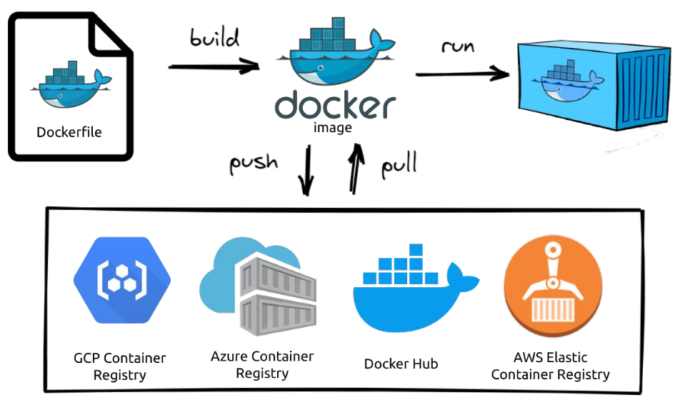

# Docker-Guide
Um gia prático e bem resumido do Docker para iniciantes. Para mais informações consulte a [documentação do Docker](https://docs.docker.com/engine/).\
Esse conteúdo é um resumo do que foi aprendido no curso de Desenvolvimento Web na [Trybe](https://www.betrybe.com/).

# Sumário

- [O que é o Docker e qual problema ele se dispõe a resolver?](#introdução)
- [O que é um container e uma imagem no Docker?](#container-e-imagem)
- Entender como instalar a ferramenta e executar um container ;
- Entender quais são os principais comandos para utilização do Docker na interface de linha de comando (CLI);
- Rodar imagens do Docker Hub (repositório oficial de imagens do Docker)

# Introdução

Existem milhares de Sistemas Operacionais (S.O), distros, frameworks, ect, no mundo. Ao desenvolver uma aplicação usando uma ferramenta é muito difícil garantir que o que funciona na máquina de uma pessoa funcionará na máquina de outra sem a necessidade de fazer novas configurações.

O Docker é uma ferramente que permite empacotar aplicações para rodá-las em qualquer S.O, distro ou servidor sem precisar fazer novas configurações. Portanto, por meio do Docker, resolvemos o problema de incompatibilidade com outros sistemas, dado que ele funciona como uma espécie de "empacotador" de todas essas dependências e requisitos para que sua aplicação funcione sem problemas!

# Container e imagem

O `container` é um processo Docker que, internamente, possui tudo aquilo que é necessário para seu funcionamento: Sistema Operacional (Binários e Bibliotecas) e recursos necessários para sua aplicação;

A `imagem` é uma espécie de "fotografia" de um container , nós resgatamos uma imagem, quando queremos iniciar um novo container a partir de uma estrutura já conhecida.

### Containers

De certa forma o container lembra muito - _mas não é_ - uma maquina virtual. Dentro dele está empacotado tudo que é preciso para aplicação rodar e quando execultado ele ultiliza os recursos da própria máquina hospedeira para virtualizar a aplicação.

### Imagens

Imagens podem se referir a praticamente qualquer tipo de container . Um exemplo disso é pensar o próprio sistema operacional Ubuntu, que possui [uma imagem oficial no Docker Hub](https://hub.docker.com/_/ubuntu).

O [Docker Hub](https://hub.docker.com/) é o principal repositório de imagens Docker atualmente. Nele, possuímos o que é chamado de [Registro](https://docs.docker.com/registry/introduction/) _(Registry)*_ , onde requisitamos essas imagens.

> _**O Registry** * é um sistema de armazenamento e entrega, no qual podemos ter um usuário com nossas próprias imagens. Algo que lembra muito o GitHub, já que podemos dar pull nessas imagens para uso posterior_.

### Fluxo padrão

Para explicar melhor a dinâmica entre containers e imagens, falaremos um pouco de como funciona o fluxo padrão do Docker :

Após isso, podemos dar push ou pull (como em um repositório do GitHub) em uma imagem no Registry *;
* Você pode dar pull na sua própria imagem (caso tenha dado push nela) ou em outra a sua escolha, como foi o caso do hello-world ).
O Registro mais comum é o Docker Hub , mas temos outros exemplos, como mostrado na imagem.
Por último, rodamos a imagem em um container , utilizando o comando run , que veremos mais adiante *.
* Após isso, temos que dizer pro container o que deve acontecer, se ele deve se manter ativo ou não, caso o contrário, o container é encerrado. O que faz parte de seu ciclo de vida.

**`Dockerfile`** - Tudo começa aqui. Este arquivo possui as _instruções_* necessárias para que possamos gerar uma imagem;
> _**Instruções** * : São as instruções de qual sistema operacional usar, tal como quais comandos devem ser executados quando a imagem for rodada em um container . Após isso, podemos dar push ou pull (como em um repositório do GitHub) em uma imagem no Registry. O Registro mais comum é o Docker Hub , mas temos outros exemplos, como mostrado na imagem._
**`image`** - É a compilação que é gerada pelo dockerfile após o build. Essa imagem é carregada num registro na nuvem como o Docker Hub. O comando `run` faz com que essa imagem como S.O e todas as confit
**`container`** - 
